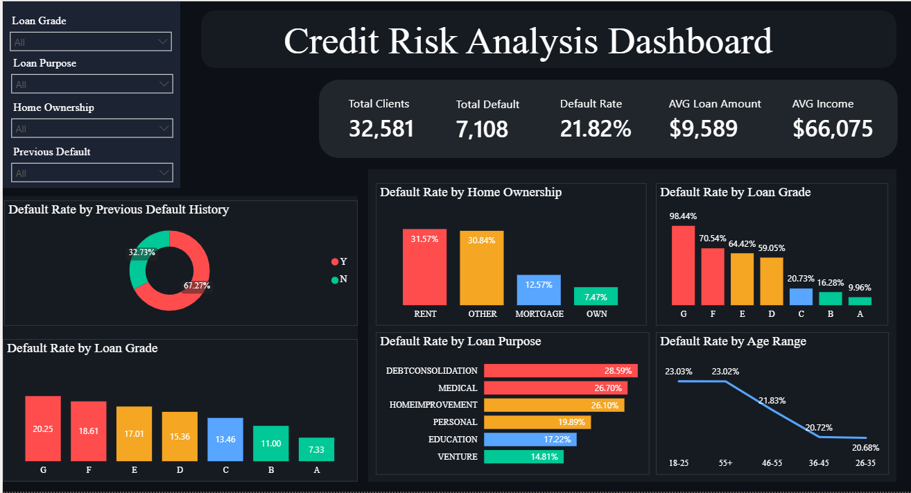

# Credit Risk Analysis


## Overview
Analysis of credit risk and loan default patterns using a dataset of 32,581 clients. The goal is to identify key factors that contribute to loan default and provide actionable insights for financial decision-making.

## Key Findings
- **21.82%** overall default rate — 1 in 5 clients failed to repay
- **Loan Grade G** has a 98.44% default rate vs 9.96% for Grade A
- **Renters** default at 4x the rate of homeowners (31.57% vs 7.47%)
- **Debt consolidation loans** carry the highest default risk (28.59%)
- Clients with **previous default history** are twice as likely to default again

## Dashboard Preview


## Tools Used
- **SQL Server** — data storage and analysis
- **SSMS** — query development
- **Power BI** — interactive dashboard

## Dataset
- Source: [Credit Risk Dataset - Kaggle](https://www.kaggle.com/datasets/laotse/credit-risk-dataset)
- 32,581 records | 12 columns
- Key fields: loan grade, intent, interest rate, default status, income, home ownership

## SQL Analyses
| # | Analysis | Key Insight |
|---|----------|-------------|
| 1 | Total records & default distribution | 21.82% default rate |
| 2 | Default rate by loan grade | Grade G: 98.44% vs Grade A: 9.96% |
| 3 | Default rate by home ownership | Renters 4x more likely to default |
| 4 | Default rate by loan purpose | Debt consolidation highest risk |
| 5 | Default rate by age range | Age is not a strong predictor |
| 6 | Average interest rate by grade | Rate increases from 7% to 20% |
| 7 | Previous default history impact | Prior default doubles current risk |
| 8 | Executive KPI summary | Full portfolio overview |

## Project Structure
```
credit-risk-analysis/
│
├── credit_risk_analysis.sql    # All SQL queries
├── dashboard.png               # Power BI dashboard screenshot
└── README.md
```

## Author
**Andry Sena** — Business Intelligence Analyst
